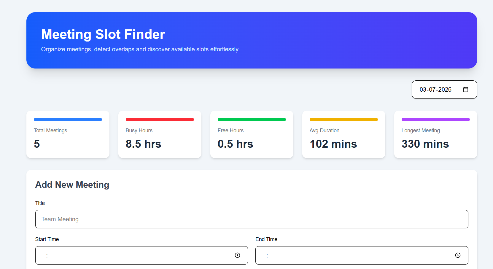
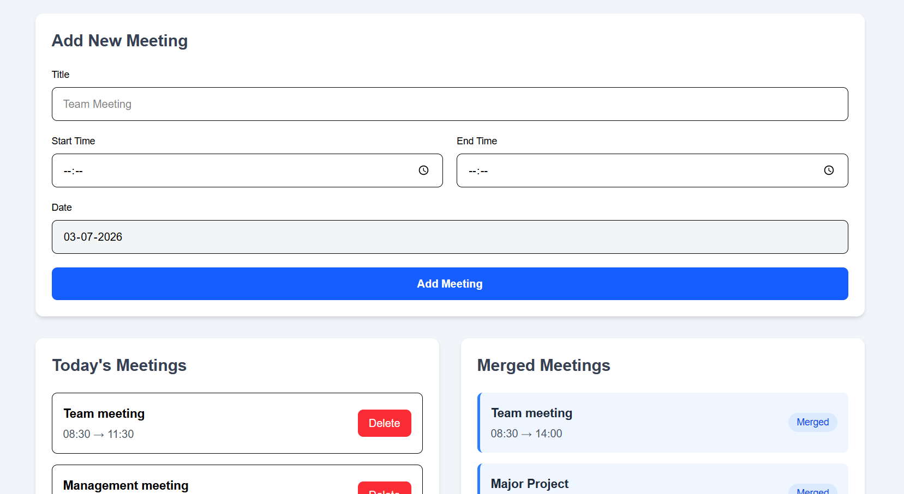
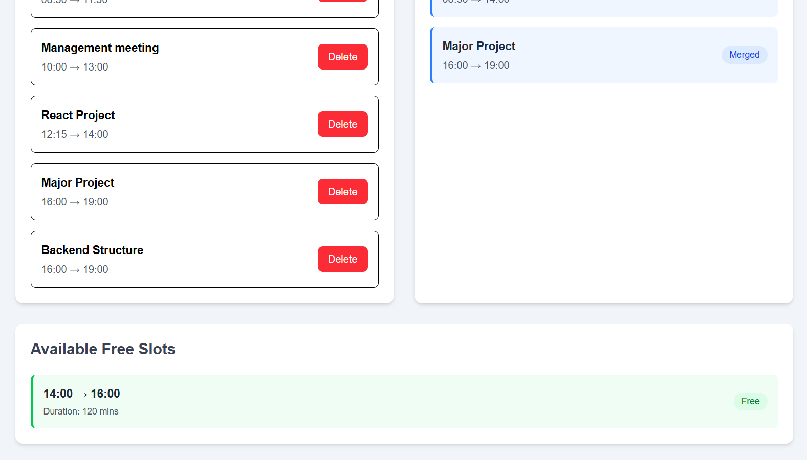

# 📅 Meeting Slot Finder

A lightweight full-stack web application that helps users organize daily meetings, detect overlapping schedules, merge meeting intervals, and discover available time slots using Data Structures and Algorithms.

---

## 🚀 Features

* Add new meetings
* View all meetings for a selected date
* Delete meetings
* Merge overlapping meetings
* Find available free slots
* View meeting statistics

  * Total Meetings
  * Busy Hours
  * Free Hours
  * Average Meeting Duration
  * Longest Meeting
* Responsive dashboard built with React and Tailwind CSS

---

## 🧠 DSA Concepts Used

### Merge Intervals

Overlapping meetings are merged into a single continuous interval.

Example:

```
09:00 - 10:00
09:30 - 11:00

↓

09:00 - 11:00
```

**Time Complexity:** `O(n log n)`

---

### Binary Search

The project is structured to support Binary Search for efficiently locating the insertion position of a meeting in a sorted schedule, enabling optimized conflict detection instead of scanning the entire meeting list.

**Time Complexity:** `O(log n)`

---

## 🛠 Tech Stack

### Frontend

* React.js
* Vite
* Tailwind CSS
* Axios

### Backend

* Node.js
* Express.js
* MongoDB
* Mongoose

---

## 📂 Folder Structure

```
meeting-slot-finder/

client/
│
├── src/
│   ├── components/
│   ├── pages/
│   ├── services/
│   ├── utils/
│   ├── App.jsx
│   ├── main.jsx
│   └── index.css

server/
│
├── algorithms/
├── config/
├── controllers/
├── models/
├── routes/
├── services/
├── utils/
├── app.js
├── server.js
└── .env
```







---

## ⚙️ Installation

### Clone the repository

```bash
git clone <repository-url>
```

### Backend

```bash
cd server

npm install

npm run dev
```

### Frontend

```bash
cd client

npm install

npm run dev
```

---

## Environment Variables

Create a `.env` file inside the `server` folder.

```env
PORT=5000
MONGO_URI=mongodb://127.0.0.1:27017/meeting_slot_finder
```

---

## API Endpoints

### Meetings

| Method | Endpoint                        | Description      |
| ------ | ------------------------------- | ---------------- |
| POST   | `/api/meetings`                 | Create a meeting |
| GET    | `/api/meetings?date=YYYY-MM-DD` | Get all meetings |
| DELETE | `/api/meetings/:id`             | Delete a meeting |

### Analytics

| Method | Endpoint                                   | Description              |
| ------ | ------------------------------------------ | ------------------------ |
| GET    | `/api/meetings/merged?date=YYYY-MM-DD`     | Get merged meetings      |
| GET    | `/api/meetings/free-slots?date=YYYY-MM-DD` | Get available free slots |
| GET    | `/api/meetings/stats?date=YYYY-MM-DD`      | Get meeting statistics   |

---

## Project Workflow

```
React Dashboard
        │
        ▼
Axios Service
        │
        ▼
Express Routes
        │
        ▼
Controllers
        │
        ▼
Services
        │
        ▼
DSA Algorithms
        │
        ▼
MongoDB
```

---

## Learning Outcomes

* Applied DSA concepts to solve real-world scheduling problems.
* Implemented a modular service-based backend architecture.
* Built RESTful APIs using Express.js.
* Designed a responsive React dashboard.
* Worked with MongoDB and Mongoose for data persistence.
* Practiced component-based frontend development using React.

---

## Future Enhancements

* Update meeting functionality
* Meeting conflict detection during creation
* Binary Search based optimized insertion
* Multiple employee schedules
* Common free slot finder using Two Pointers
* Authentication and user-specific schedules

---

## Author

Developed as a DSA-focused MERN mini project to demonstrate practical algorithm implementation and problem-solving skills.
